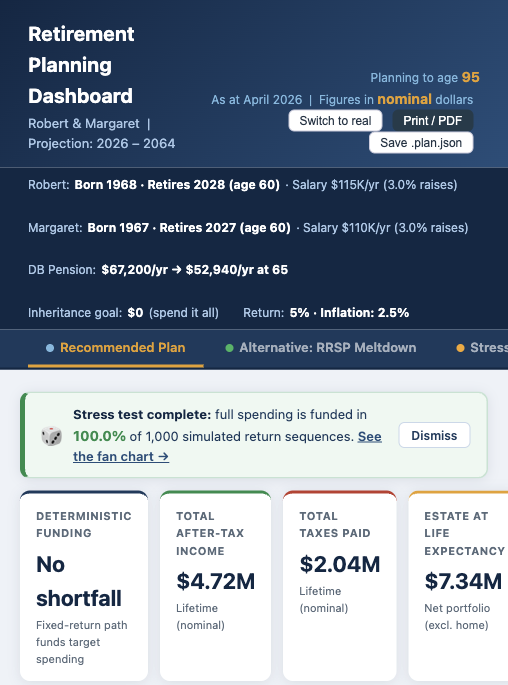

# Canadian Retirement Planner Product Docs

[](https://github.com/evansmic/retirement-dashboard/actions/workflows/probes.yml)
[](LICENSE)



This is a free, local-first Canadian retirement planner for Ontario households using 2026 tax and benefit assumptions. It runs in your browser, does not require an account, and lets you save or reopen a local `.plan.json` file on your own device.

Planning retirement in Canada is more complicated than most simple calculators suggest. CPP and OAS timing, RRSP/RRIF/LIF withdrawals, TFSA use, taxable investments, OAS clawback, pension splitting, survivor rules, working years, home downsizing, and spending phases all interact. Professional tools handle more of that complexity, but they are usually built for advisors and account-backed workflows.

This project aims to make that modelling more transparent for DIY households. The current launch version frames the first dashboard view as the recommended plan and keeps alternatives and stress tests as supporting diagnostics. It does **not** yet include a full optimizer that searches every CPP/OAS age, withdrawal order, guardrail, pension-splitting, and estate trade-off.

> **Not financial advice.** This is an educational planning tool, not a substitute for advice from a qualified financial planner, accountant, or tax professional. Tax rules change; verify current figures with the CRA, Service Canada, and your province before acting. Full disclaimer at the bottom.

## What it models

| Area | What's modelled |
|---|---|
| **Tax** | Federal + Ontario brackets, BPA phase-out, Ontario surtax + Health Premium, pension splitting, capital-gains inclusion, OAS clawback. |
| **Registered accounts** | RRSP/RRIF (with minimums), LIRA/LIF (with 1.3× RRIF max), TFSA, spousal-RRSP 3-year attribution. |
| **CPP / OAS** | Actuarial adjustment from 60–70, CPP sharing, OAS at 65 with 0.6%/mo deferral up to 70. |
| **Couples** | Staggered retirement, dual DB pensions, survivor rollover (registered + non-reg with ACB preserved), CPP survivor benefit. |
| **Working years** | Pre-retirement salary growth, RRSP/TFSA/non-reg contributions, dual DB accruals. |
| **Stress testing** | Recommended-plan framing with supporting alternatives/stress diagnostics (RRSP Meltdown, 0% Return, Survivor, Max Spend), Monte Carlo (1,000 paths), and sequence-of-returns stress (1929/1973/2000/2008). |
| **Output** | Income-stack, balances, tax, and estate charts; year-by-year detail table; comparison table with stress/funding metrics; PDF print export. |

## Current limits

- Ontario tax only. Quebec, BC, Alberta, and other provinces are not yet supported.
- 2026 tax and benefit assumptions only; this needs an annual update pass.
- No GIS, RDSP/DTC, Quebec/QPP, corporate-owned investments, or full estate/deemed-disposition module.
- No full recommended-plan optimizer yet. The current dashboard is recommendation-framed, with deterministic scenarios and stress diagnostics.
- No account system, cloud sync, paid license flow, advisor workspace, or AI report drafting.
- Mobile is a sanity-check target, but the dashboard is still desktop-first.

## About this repo

This repository holds the local-first planner prototype plus the product, architecture, validation, roadmap, and launch materials for evolving it into a consumer-first Canadian retirement planning product.

## Privacy

All calculations happen client-side in your browser. Your inputs are encoded into the URL hash, the part after `#`; normal HTTP requests do not send that fragment to the server. Local `.plan.json` save/load reads and writes files you choose on your device.

There is no account requirement for core planning, local save/load, import/export, or seeing results. The app should not collect analytics on household financial inputs, URL hashes, balances, income, spending, debts, pensions, tax rows, or result rows. The only current runtime network dependency is a CDN request for Chart.js.

You can still choose to share private information yourself by sending someone a URL, screenshot, PDF, or `.plan.json` file. Treat those exports as sensitive financial documents.

## Free / paid direction

The public planner should remain genuinely useful for free: local intake, examples, recommended-plan framing, basic stress context, local `.plan.json` files, validation visibility, and no required account.

If paid features are added later, the intended boundary is local-first capability rather than data capture. Good paid candidates include richer scenario building, polished reports, implementation checklists, expanded validation exports, guardrail/flexible-spending modes, and more provinces. Accounts remain optional infrastructure for sync, license recovery, sharing, adult-child/advisor collaboration, or multi-device continuity.

## Tested

500 checks across the canonical Node-based regression probes cover the extracted tax/benefit helper module, tax math, pension-income-credit eligibility, age 64-72 tax/benefit fixtures, scenario behaviour, Monte Carlo + sequence-of-returns stress severity, validation export shape, public-comparator fixture, schema migration, example-preset registry, intake round-trip, local plan-file round-trip and malformed-file rejection, critical intake validation, and progressive Monte Carlo lifecycle. Run the suite locally with:

```bash
cd probes
./run_all.sh
```

See [`probes/README.md`](probes/README.md) for what each probe covers and how to add new ones. The 2026 federal/Ontario tax methodology is documented in [`validation/tax_methodology_2026.md`](validation/tax_methodology_2026.md).

The current free/public comparator run is documented in [`validation/external-results/free_public_comparison_2026-04-28.md`](validation/external-results/free_public_comparison_2026-04-28.md). External calculators rarely match exactly; the validation notes record assumptions and variance rather than claiming perfect agreement.

## Run locally

Open [`index.html`](index.html) in a browser to start a plan, or open [`retirement_dashboard.html`](retirement_dashboard.html) to view bundled examples. Because this is static HTML, no build step is required. If your browser blocks local file behaviours, serve the folder with any local static server and open the same files from `localhost`.

## Tech

- HTML / CSS / vanilla JavaScript — no framework, no build step.
- [Chart.js](https://www.chartjs.org/) is the only external runtime dependency, loaded from a CDN.
- Node 18+ to run the probe suite locally; CI runs on Node 20.

## Repo guide

| File | Purpose |
|---|---|
| `index.html` | Intake form. Encodes `D` into the URL hash and supports local `.plan.json` save/load. |
| `retirement_dashboard.html` | Engine + dashboard. Reads the hash and renders the recommended plan plus alternatives/stress diagnostics. |
| `probes/` | Node-based regression suite. See [`probes/README.md`](probes/README.md). |
| `validation/` | Baseline exports, public-comparator notes, and the [`2026 tax methodology`](validation/tax_methodology_2026.md). |
| `docs/schema_v3_output_contract.md` | Draft local-first v3 plan/result contract for the recommended-plan-first product. |
| `docs/local_monetization_sketch.md` | Free / Plus / Pro capability boundary for local-first paid packaging. |
| `docs/account_boundary_decision.md` | Account boundary: optional infrastructure only, not required for core local planning. |
| `docs/license_privacy_threat_model.md` | License and privacy threat model for local unlocks, sync, sharing, AI, analytics, and support exports. |
| `docs/sprint_4_launch_package.md` | Sprint 4 launch/productization package. |
| `docs/sprint_4_launch_execution.md` | Sprint 4 execution record for copy, smoke tests, validation, CI, release, and launch prep. |
| `docs/launch_posts.md` | Draft launch posts for public channels. |
| `PROJECT.md` | Project overview, problem, value proposition, tech stack. |
| `ROADMAP.md` | Completed milestones, current phase, future ideas. |
| `DB_SCHEMA.md` | The `D` payload contract (schema). |
| `USER_FLOWS.md` | Main user flows + friction points + missing flows. |
| `TASKS.md` | Sprint plan — current and backlog. |
| `DECISIONS.md` | Architecture decisions made + open questions. |
| `PITCH.md` | Investor / customer / tagline drafts (productisation thinking). |

## Status

Engine models federal + Ontario 2026 tax rules and the 500-check regression suite covers the core rules end-to-end. Sprint 1, Sprint 2, Sprint 0, and Sprint 3 are complete: trust gates, local `.plan.json` persistence, guided form navigation, blank-field validation, and recommended-plan framing are in place. Sprint 4 is the active launch/productization package. See [`ROADMAP.md`](ROADMAP.md).

## License

[MIT](LICENSE) — © 2026 Michael Evans.

## Disclaimer

**This dashboard is not financial advice.** It is an educational planning tool, not a substitute for advice from a qualified financial planner, accountant, or tax professional. Projections rely on the inputs you supply and on simplifying assumptions about taxes, returns, inflation, and government benefits — actual outcomes will differ. The author makes no warranty as to the accuracy or completeness of the calculations and accepts no liability for decisions made on the basis of them. Tax rules and benefit thresholds change; verify current figures with the CRA, Service Canada, and your province before acting. Consult a licensed advisor for decisions involving real money.
